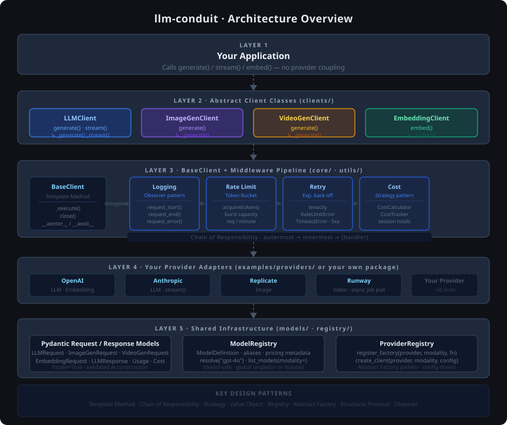

# conduit-sdk

[](https://github.com/your-org/conduit-sdk/actions/workflows/ci.yml)
[](https://badge.fury.io/py/conduit-sdk)
[](https://pypi.org/project/conduit-sdk/)
[](https://opensource.org/licenses/MIT)
[](https://github.com/astral-sh/ruff)

A generic, provider-agnostic Python SDK for building AI model clients across four modalities: **LLM**, **image generation**, **video generation**, and **embeddings**.

`conduit-sdk` is designed to be a **foundational package**. It defines clean interfaces, shared request/response schemas, and a full middleware stack — so you can write a thin provider adapter and immediately get retry logic, rate limiting, cost tracking, and structured logging for free.

```
pip install conduit-sdk
```

---

## Table of Contents

- [Why conduit-sdk?](#why-conduit-sdk)
- [Architecture Overview](#architecture-overview)
- [Installation](#installation)
- [Quickstart](#quickstart)
  - [LLM (Chat Completion)](#llm-chat-completion)
  - [Image Generation](#image-generation)
  - [Video Generation](#video-generation)
  - [Embeddings](#embeddings)
- [Configuration](#configuration)
  - [Retry](#retry)
  - [Rate Limiting](#rate-limiting)
  - [Cost Tracking](#cost-tracking)
  - [Structured Logging](#structured-logging)
- [Middleware Pipeline](#middleware-pipeline)
- [Registry](#registry)
  - [ModelRegistry](#modelregistry)
  - [ProviderRegistry](#providerregistry)
- [Writing a Custom Provider](#writing-a-custom-provider)
  - [LLM with streaming](#llm-with-streaming)
  - [Image client](#image-client)
  - [Video client](#video-client)
  - [Embedding client](#embedding-client)
- [Design Patterns](#design-patterns)
- [Request & Response Reference](#request--response-reference)
- [Running Tests](#running-tests)
- [Contributing](#contributing)

---

## Why conduit-sdk?

Every AI provider has its own SDK, its own request shape, and its own error semantics. When you build on top of multiple providers — or want to swap one for another — you end up duplicating retry loops, rate-limit handling, and cost math across every integration.

`conduit-sdk` fixes this by giving you:

- **Stable, typed interfaces** for every modality — your application code stays the same regardless of which provider is underneath.
- **A middleware pipeline** for cross-cutting concerns that runs automatically on every call, with zero boilerplate in your provider adapter.
- **Pydantic-validated request and response objects** so you catch schema errors before a network call is ever made.
- **A registry** so you can resolve clients by string name at runtime, enabling config-driven provider selection.

---

## Architecture Overview



The SDK is organized in five layers, each with a single responsibility:

**Layer 1 — Your Application.** Calls the stable public API (`generate`, `stream`, `embed`). Never imports a provider SDK directly.

**Layer 2 — Abstract Clients.** One ABC per modality (`LLMClient`, `ImageGenClient`, `VideoGenClient`, `EmbeddingClient`). Each exposes a typed, async public method and one or two abstract hooks for the provider to fill in.

**Layer 3 — BaseClient + Middleware Pipeline.** The Chain of Responsibility that runs on every call: `LoggingMiddleware → RateLimitMiddleware → RetryMiddleware → CostMiddleware → [your handler]`. Adding or removing a concern is one line.

**Layer 4 — Your Provider Adapters.** Thin subclasses (~50 lines) that implement `_generate` / `_embed` by calling the real provider SDK. Reference skeletons for OpenAI, Anthropic, Replicate, and Runway live in `examples/providers/`.

**Layer 5 — Shared Infrastructure.** Immutable Pydantic request/response models, `ModelRegistry` (metadata catalogue), and `ProviderRegistry` (Abstract Factory for config-driven client creation).

All shared concerns live in the pipeline. Your adapter implements exactly one or two abstract methods.

---

## Installation

```bash
pip install conduit-sdk
```

**Python 3.11+ recommended** (3.10 supported). Dependencies: `pydantic>=2.7`, `tenacity>=8.3`, `anyio>=4.4`.

For development:

```bash
git clone https://github.com/your-org/conduit-sdk
cd conduit-sdk
pip install -e ".[dev]"
```

---

## Quickstart

### LLM (Chat Completion)

```python
import asyncio
from conduit_sdk.clients import LLMClient
from conduit_sdk.core.config import ClientConfig
from conduit_sdk.models.common import Message
from conduit_sdk.models.requests import LLMRequest
from conduit_sdk.models.responses import LLMResponse

# 1. Implement your provider adapter
class MyOpenAIClient(LLMClient):
    async def _generate(self, request: LLMRequest) -> LLMResponse:
        import openai
        client = openai.AsyncOpenAI(api_key=self.config.api_key)
        raw = await client.chat.completions.create(
            model=self.config.model,
            messages=[{"role": m.role, "content": m.content} for m in request.messages],
            max_tokens=request.max_tokens,
            temperature=request.temperature or 1.0,
        )
        from conduit_sdk.models.common import Message, MessageRole, Usage
        from conduit_sdk.models.responses import FinishReason
        return LLMResponse(
            message=Message(role=MessageRole.ASSISTANT, content=raw.choices[0].message.content),
            finish_reason=FinishReason(raw.choices[0].finish_reason),
            usage=Usage(
                prompt_tokens=raw.usage.prompt_tokens,
                completion_tokens=raw.usage.completion_tokens,
                total_tokens=raw.usage.total_tokens,
            ),
            model=raw.model,
            provider="openai",
        )

    async def _stream(self, request: LLMRequest):
        import openai
        client = openai.AsyncOpenAI(api_key=self.config.api_key)
        stream = await client.chat.completions.create(
            model=self.config.model,
            messages=[{"role": m.role, "content": m.content} for m in request.messages],
            stream=True,
        )
        async for chunk in stream:
            if chunk.choices[0].delta.content:
                yield chunk.choices[0].delta.content

# 2. Configure and instantiate
config = ClientConfig(
    provider="openai",
    model="gpt-4o",
    api_key="sk-...",
)
client = MyOpenAIClient(config=config)

# 3. Call it
async def main():
    request = LLMRequest(messages=[
        Message.system("You are a helpful assistant."),
        Message.user("Explain transformers in one sentence."),
    ])

    # Non-streaming
    response = await client.generate(request)
    print(response.content)
    print(f"Tokens used: {response.usage.total_tokens}")
    print(f"Cost: ${response.cost.total_cost:.4f}")  # populated by CostMiddleware

    # Streaming
    async for chunk in client.stream(request):
        print(chunk, end="", flush=True)

asyncio.run(main())

# Synchronous wrapper (no event loop needed)
response = client.generate_sync(request)
```

---

### Image Generation

```python
from conduit_sdk.clients import ImageGenClient
from conduit_sdk.models.requests import ImageGenRequest, ImageSize
from conduit_sdk.models.responses import ImageGenResponse, GeneratedImage
from conduit_sdk.models.common import Usage

class MyImageClient(ImageGenClient):
    async def _generate(self, request: ImageGenRequest) -> ImageGenResponse:
        raw = await my_provider.text_to_image(
            prompt=request.prompt,
            width=request.size.width,
            height=request.size.height,
            num_images=request.num_images,
            seed=request.seed,
        )
        return ImageGenResponse(
            images=[GeneratedImage(url=img.url, seed=img.seed) for img in raw.images],
            usage=Usage(image_count=len(raw.images)),
            provider="my_provider",
        )

client = MyImageClient(config=ClientConfig(model="stable-diffusion-3"))

response = await client.generate(ImageGenRequest(
    prompt="A photorealistic sunset over mountains, golden hour",
    size=ImageSize(width=1024, height=768),
    num_images=2,
    steps=30,
    guidance_scale=7.5,
))

print(response.first.url)       # first image URL
print(len(response.images))     # 2
```

---

### Video Generation

```python
from conduit_sdk.clients import VideoGenClient
from conduit_sdk.models.requests import VideoGenRequest
from conduit_sdk.models.responses import VideoGenResponse, GeneratedVideo

class MyVideoClient(VideoGenClient):
    async def _generate(self, request: VideoGenRequest) -> VideoGenResponse:
        # Many video providers use async job polling
        job = await my_provider.submit_video_job(
            prompt=request.prompt,
            duration=request.duration_seconds,
            fps=request.fps,
        )
        url = await job.poll_until_complete()   # provider-specific polling
        return VideoGenResponse(
            videos=[GeneratedVideo(
                url=url,
                duration_seconds=request.duration_seconds,
                fps=request.fps,
            )],
        )

client = MyVideoClient(config=ClientConfig(model="runway-gen3"))

response = await client.generate(VideoGenRequest(
    prompt="A drone flyover of a coastal city at dusk",
    duration_seconds=5.0,
    fps=24,
))

print(response.first.url)
```

---

### Embeddings

```python
from conduit_sdk.clients import EmbeddingClient
from conduit_sdk.models.requests import EmbeddingRequest
from conduit_sdk.models.responses import EmbeddingResponse, Embedding
from conduit_sdk.models.common import Usage

class MyEmbeddingClient(EmbeddingClient):
    async def _embed(self, request: EmbeddingRequest) -> EmbeddingResponse:
        raw = await my_provider.embed(
            texts=request.inputs,
            model=self.config.model,
            dimensions=request.dimensions,
        )
        return EmbeddingResponse(
            embeddings=[
                Embedding(index=i, vector=vec)
                for i, vec in enumerate(raw.vectors)
            ],
            usage=Usage(
                prompt_tokens=raw.tokens_used,
                total_tokens=raw.tokens_used,
                embedding_count=len(request.inputs),
            ),
        )

client = MyEmbeddingClient(config=ClientConfig(model="text-embedding-3-large"))

response = await client.embed(EmbeddingRequest(
    inputs=["The quick brown fox", "A lazy dog"],
    input_type="document",   # hint for asymmetric retrieval
))

print(len(response.vectors))       # 2
print(response.dimensions)         # e.g. 3072
```

---

## Configuration

All configuration lives in `ClientConfig`, an immutable Pydantic value object passed to the client constructor.

```python
from conduit_sdk.core.config import (
    ClientConfig,
    RetryConfig,
    RateLimitConfig,
    LoggingConfig,
    CostConfig,
)

config = ClientConfig(
    provider="openai",
    model="gpt-4o",
    api_key="sk-...",
    timeout_seconds=30.0,
    retry=RetryConfig(
        max_attempts=5,
        min_wait_seconds=1.0,
        max_wait_seconds=30.0,
        multiplier=2.0,
    ),
    rate_limit=RateLimitConfig(
        requests_per_minute=60.0,
        burst=10,
    ),
    logging=LoggingConfig(
        enabled=True,
        level="INFO",
        include_request_body=False,   # set True only for debugging — may log PII
    ),
    cost=CostConfig(
        enabled=True,
        input_cost_per_1k_tokens=0.005,    # USD
        output_cost_per_1k_tokens=0.015,
    ),
    extra={"organization": "org-abc"},     # provider-specific pass-through
)
```

### Retry

Retry uses exponential back-off via [tenacity](https://tenacity.readthedocs.io). It retries on:

- `RateLimitError` (429)
- `TimeoutError`
- `ProviderError` with HTTP status >= 500

All other exceptions propagate immediately without retrying.

```python
RetryConfig(
    max_attempts=3,       # total attempts (1 original + N-1 retries)
    min_wait_seconds=1.0,
    max_wait_seconds=60.0,
    multiplier=2.0,       # each wait = previous * multiplier
    reraise=True,         # re-raise last exception after exhaustion
)
```

### Rate Limiting

A token-bucket limiter is built into every client. The bucket fills at `requests_per_minute / 60` tokens per second and allows short bursts up to `burst`.

```python
RateLimitConfig(
    requests_per_minute=60.0,
    burst=10,
)
```

To share a single rate limit across multiple client instances:

```python
from conduit_sdk.utils.rate_limit import TokenBucketRateLimiter, RateLimitMiddleware
from conduit_sdk.core.middleware import MiddlewarePipeline

shared_limiter = TokenBucketRateLimiter(rate=1.0, burst=5)  # 60 rpm

pipeline = MiddlewarePipeline([
    RateLimitMiddleware(limiter=shared_limiter),
])

client_a = MyLLMClient(config=config, middleware=pipeline)
client_b = MyLLMClient(config=config, middleware=pipeline)
# Both clients share the same token bucket
```

### Cost Tracking

`CostMiddleware` calculates estimated cost from usage stats after each call and attaches a `Cost` object to the response. To accumulate totals across a session:

```python
from conduit_sdk.utils.cost import CostTracker, CostMiddleware
from conduit_sdk.core.middleware import MiddlewarePipeline

tracker = CostTracker()

pipeline = MiddlewarePipeline([
    CostMiddleware(config.cost, tracker=tracker),
])
client = MyLLMClient(config=config, middleware=pipeline)

# After N calls:
print(tracker.summary())
# {'call_count': 5, 'total_tokens': 8420, 'total_cost_usd': 0.0421}
```

### Structured Logging

All log events are emitted under the `conduit_sdk` logger with structured `extra` fields, making them easy to parse with any log aggregator (Datadog, CloudWatch, Loki, etc.).

```python
import logging
import json

# Attach a JSON handler to see structured output
class JsonHandler(logging.StreamHandler):
    def emit(self, record):
        data = {k: v for k, v in record.__dict__.items()
                if k.startswith("sdk_")}
        data["message"] = record.getMessage()
        print(json.dumps(data))

logging.getLogger("conduit_sdk").addHandler(JsonHandler())
logging.getLogger("conduit_sdk").setLevel(logging.INFO)
```

Example output:

```json
{"sdk_event": "conduit_sdk.request.start", "provider": "openai", "model": "gpt-4o", "request_type": "LLMRequest", "message": "conduit_sdk.request.start"}
{"sdk_event": "conduit_sdk.request.end", "provider": "openai", "model": "gpt-4o", "latency_ms": 843.2, "prompt_tokens": 42, "completion_tokens": 118, "total_tokens": 160, "cost_usd": 0.00201, "message": "conduit_sdk.request.end"}
```

---

## Middleware Pipeline

The pipeline follows the **Chain of Responsibility** pattern. Each middleware receives the call context and a `next_call` callable; it can inspect, modify, or short-circuit the chain.

Default order (outermost → innermost):

```
Logging → RateLimit → Retry → Cost → [your _generate / _embed]
```

You can build a fully custom pipeline:

```python
from conduit_sdk.core.middleware import Middleware, MiddlewarePipeline, CallContext

class TracingMiddleware(Middleware):
    """Example: inject a trace ID into every call."""

    async def __call__(self, ctx: CallContext, next_call) -> ...:
        import uuid
        ctx.metadata["trace_id"] = str(uuid.uuid4())
        return await next_call(ctx)

pipeline = MiddlewarePipeline([
    TracingMiddleware(),
    LoggingMiddleware(config.logging),
    RateLimitMiddleware(config.rate_limit),
    RetryMiddleware(config.retry),
    CostMiddleware(config.cost),
])

client = MyLLMClient(config=config, middleware=pipeline)
```

Pass `middleware=MiddlewarePipeline([])` to disable all middleware (useful in tests).

---

## Registry

### ModelRegistry

A thread-safe catalogue of named model definitions. Use it to store model metadata (context window, pricing, aliases) and resolve models by string key at runtime.

```python
from conduit_sdk.registry import ModelRegistry, ModelDefinition

registry = ModelRegistry.global_registry()

registry.register(ModelDefinition(
    name="openai/gpt-4o",
    provider="openai",
    modality="llm",
    aliases=["gpt-4o", "gpt4o"],
    context_window=128_000,
    max_output_tokens=4_096,
    input_cost_per_1k_tokens=0.005,
    output_cost_per_1k_tokens=0.015,
    metadata={"supports_vision": True, "supports_function_calling": True},
))

registry.register(ModelDefinition(
    name="stability/sd3",
    provider="stability",
    modality="image",
    aliases=["sd3"],
    image_cost_per_unit=0.065,
))

# Resolve by canonical name or alias
defn = registry.resolve("gpt-4o")
print(defn.context_window)   # 128000

# List all LLM models
for model in registry.list_models(modality="llm"):
    print(model.name)
```

### ProviderRegistry

Maps `(provider, modality)` pairs to factory callables that produce configured client instances.

```python
from conduit_sdk.registry import ProviderRegistry
from conduit_sdk.core.config import ClientConfig

provider_registry = ProviderRegistry.global_registry()

provider_registry.register_factory(
    provider="openai",
    modality="llm",
    factory=lambda cfg: MyOpenAIClient(config=cfg),
)

provider_registry.register_factory(
    provider="stability",
    modality="image",
    factory=lambda cfg: MyStabilityClient(config=cfg),
)

# Resolve a client from config (e.g. from a YAML config file)
client = provider_registry.create_client(
    provider="openai",
    modality="llm",
    config=ClientConfig(model="gpt-4o", api_key="sk-..."),
)

response = await client.generate(LLMRequest(messages=[Message.user("Hello")]))
```

---

## Writing a Custom Provider

Implement 1–2 abstract methods. Everything else is inherited.

### LLM with streaming

```python
from collections.abc import AsyncIterator
from conduit_sdk.clients import LLMClient
from conduit_sdk.core.config import ClientConfig
from conduit_sdk.models.requests import LLMRequest
from conduit_sdk.models.responses import LLMResponse, FinishReason
from conduit_sdk.models.common import Message, MessageRole, Usage

class AnthropicClient(LLMClient):
    """
    Adapter for Anthropic's Messages API.

    Required overrides: _generate, _stream
    """

    async def _generate(self, request: LLMRequest) -> LLMResponse:
        import anthropic

        sdk = anthropic.AsyncAnthropic(api_key=self.config.api_key)
        system = next(
            (m.content for m in request.messages if m.role == MessageRole.SYSTEM), None
        )
        user_messages = [
            {"role": m.role.value, "content": m.content}
            for m in request.messages
            if m.role != MessageRole.SYSTEM
        ]

        raw = await sdk.messages.create(
            model=self.config.model,
            system=system,
            messages=user_messages,
            max_tokens=request.max_tokens or 1024,
        )

        return LLMResponse(
            message=Message(role=MessageRole.ASSISTANT, content=raw.content[0].text),
            finish_reason=FinishReason(raw.stop_reason or "stop"),
            usage=Usage(
                prompt_tokens=raw.usage.input_tokens,
                completion_tokens=raw.usage.output_tokens,
                total_tokens=raw.usage.input_tokens + raw.usage.output_tokens,
            ),
            model=raw.model,
            provider="anthropic",
            raw_response=raw,
        )

    async def _stream(self, request: LLMRequest) -> AsyncIterator[str]:
        import anthropic

        sdk = anthropic.AsyncAnthropic(api_key=self.config.api_key)
        async with sdk.messages.stream(
            model=self.config.model,
            messages=[{"role": m.role.value, "content": m.content}
                      for m in request.messages],
            max_tokens=request.max_tokens or 1024,
        ) as stream:
            async for text in stream.text_stream:
                yield text
```

### Image client

```python
from conduit_sdk.clients import ImageGenClient
from conduit_sdk.models.requests import ImageGenRequest
from conduit_sdk.models.responses import ImageGenResponse, GeneratedImage
from conduit_sdk.models.common import Usage

class ReplicateImageClient(ImageGenClient):
    """
    Adapter for Replicate image models.

    Required overrides: _generate
    """

    async def _generate(self, request: ImageGenRequest) -> ImageGenResponse:
        import replicate

        output = await replicate.async_run(
            self.config.model,
            input={
                "prompt": request.prompt,
                "negative_prompt": request.negative_prompt or "",
                "width": request.size.width,
                "height": request.size.height,
                "num_outputs": request.num_images,
                "num_inference_steps": request.steps or 28,
                "guidance_scale": request.guidance_scale or 7.5,
                "seed": request.seed,
            },
        )

        return ImageGenResponse(
            images=[GeneratedImage(url=url) for url in output],
            usage=Usage(image_count=len(output)),
            provider="replicate",
        )
```

### Video client

```python
from conduit_sdk.clients import VideoGenClient
from conduit_sdk.models.requests import VideoGenRequest
from conduit_sdk.models.responses import VideoGenResponse, GeneratedVideo

class RunwayVideoClient(VideoGenClient):
    """
    Adapter for Runway Gen-3.

    Required overrides: _generate
    """

    async def _generate(self, request: VideoGenRequest) -> VideoGenResponse:
        import runwayml

        sdk = runwayml.AsyncRunwayML(api_key=self.config.api_key)
        task = await sdk.image_to_video.create(
            model=self.config.model,
            prompt_text=request.prompt,
            duration=int(request.duration_seconds),
            ratio="16:9",
        )
        # Poll until complete
        import asyncio
        while task.status not in ("SUCCEEDED", "FAILED"):
            await asyncio.sleep(5)
            task = await sdk.tasks.retrieve(task.id)

        return VideoGenResponse(
            videos=[GeneratedVideo(
                url=task.output[0],
                duration_seconds=request.duration_seconds,
                fps=request.fps,
            )],
            provider="runway",
        )
```

### Embedding client

```python
from conduit_sdk.clients import EmbeddingClient
from conduit_sdk.models.requests import EmbeddingRequest
from conduit_sdk.models.responses import EmbeddingResponse, Embedding
from conduit_sdk.models.common import Usage

class OpenAIEmbeddingClient(EmbeddingClient):
    """
    Adapter for OpenAI Embeddings API.

    Required overrides: _embed
    """

    async def _embed(self, request: EmbeddingRequest) -> EmbeddingResponse:
        import openai

        sdk = openai.AsyncOpenAI(api_key=self.config.api_key)
        raw = await sdk.embeddings.create(
            model=self.config.model,
            input=request.inputs,
            dimensions=request.dimensions,
            encoding_format=request.encoding_format,
        )

        return EmbeddingResponse(
            embeddings=[
                Embedding(index=item.index, vector=item.embedding)
                for item in raw.data
            ],
            usage=Usage(
                prompt_tokens=raw.usage.prompt_tokens,
                total_tokens=raw.usage.total_tokens,
                embedding_count=len(request.inputs),
            ),
            model=raw.model,
            provider="openai",
        )
```

---

## Design Patterns

| Pattern | Where it's used |
|---|---|
| **Template Method** | `BaseClient._execute` defines the pipeline; subclasses override `_generate`/`_embed` hooks |
| **Chain of Responsibility** | `MiddlewarePipeline` — each `Middleware` wraps the next |
| **Strategy** | `CostCalculator` — swap in a custom pricing strategy without touching middleware |
| **Value Object** | `ClientConfig`, all request/response models — immutable Pydantic frozen models |
| **Registry** | `ModelRegistry` and `ProviderRegistry` — resolve named models and factories at runtime |
| **Abstract Factory** | `ProviderRegistry.create_client` — construct clients without knowing the concrete class |
| **Structural Protocol** | `LLMProtocol` et al. (PEP 544) — duck-typed interfaces for static analysis without forced inheritance |
| **Observer** | `StructuredLogger` — structured log events decoupled from any specific log sink |

---

## Request & Response Reference

### LLMRequest

| Field | Type | Default | Description |
|---|---|---|---|
| `messages` | `list[Message]` | required | Conversation history (min 1) |
| `max_tokens` | `int \| None` | `None` | Max completion length |
| `temperature` | `float \| None` | `None` | Sampling temperature [0, 2] |
| `top_p` | `float \| None` | `None` | Nucleus sampling [0, 1] |
| `stop` | `list[str] \| None` | `None` | Up to 4 stop sequences |
| `tools` | `list[ToolDefinition] \| None` | `None` | Function-calling definitions |
| `stream` | `bool` | `False` | Hint to use streaming endpoint |
| `model` | `str \| None` | `None` | Per-request model override |
| `extra` | `dict` | `{}` | Provider-specific pass-through |

### LLMResponse

| Field | Type | Description |
|---|---|---|
| `message` | `Message` | Assistant reply |
| `finish_reason` | `FinishReason` | `stop`, `length`, `tool_calls`, `content_filter` |
| `tool_calls` | `list[ToolCall]` | Parsed function calls |
| `usage` | `Usage` | Token counts |
| `cost` | `Cost \| None` | Estimated cost (set by CostMiddleware) |
| `latency_ms` | `float \| None` | Wall-clock latency |
| `model` | `str` | Model that served the request |
| `provider` | `str` | Provider identifier |

### ImageGenRequest

| Field | Type | Default | Description |
|---|---|---|---|
| `prompt` | `str` | required | Text description |
| `negative_prompt` | `str \| None` | `None` | Concepts to exclude |
| `reference_image_url` | `str \| None` | `None` | Seed image for img2img |
| `size` | `ImageSize` | `1024×1024` | Output dimensions |
| `num_images` | `int` | `1` | Images per call [1, 10] |
| `steps` | `int \| None` | `None` | Diffusion steps |
| `guidance_scale` | `float \| None` | `None` | CFG strength |
| `seed` | `int \| None` | `None` | Reproducibility seed |
| `output_format` | `"png" \| "jpeg" \| "webp"` | `"png"` | Output format |

### VideoGenRequest

| Field | Type | Default | Description |
|---|---|---|---|
| `prompt` | `str` | required | Text description |
| `reference_image_url` | `str \| None` | `None` | First frame / keyframe |
| `duration_seconds` | `float` | `4.0` | Clip length (up to 300s) |
| `fps` | `int` | `24` | Frames per second |
| `resolution` | `ImageSize` | `1280×720` | Output resolution |
| `seed` | `int \| None` | `None` | Reproducibility seed |

### EmbeddingRequest

| Field | Type | Default | Description |
|---|---|---|---|
| `inputs` | `list[str]` | required | Texts (or base-64 images) to encode |
| `dimensions` | `int \| None` | `None` | Target dimensions (MRL support) |
| `encoding_format` | `"float" \| "base64"` | `"float"` | Vector encoding |
| `input_type` | `"query" \| "document" \| "image" \| None` | `None` | Asymmetric retrieval hint |

---

## Running Tests

```bash
# Install dev dependencies
pip install -e ".[dev]"

# Run all tests
pytest

# Run with coverage
pytest --cov=conduit_sdk --cov-report=term-missing

# Run a specific modality
pytest tests/test_llm.py -v

# Lint
ruff check conduit_sdk tests

# Type-check
mypy conduit_sdk
```

The test suite uses in-memory mock providers — no API keys or network access required.

---

## Contributing

All contributions are welcome. The key rule: **new cross-cutting concerns go in middleware, not in client classes.**

**Adding a new provider:** subclass the relevant client, implement the abstract method(s), and submit a PR to the `examples/` directory. Your adapter should cover at least one happy-path test using a mock HTTP fixture.

**Adding a new modality:** create a `models/requests.py` entry, a `models/responses.py` entry, a new abstract client in `clients/`, and a matching protocol in `core/protocols.py`. Add the new type to the `AnyRequest`/`AnyResponse` unions.

**Adding new middleware:** subclass `Middleware`, implement `__call__`, and add tests. Middleware should be stateless where possible (or thread-safe if it holds state).

Please run `pytest` and `ruff check` before opening a PR.

---

## License

MIT
